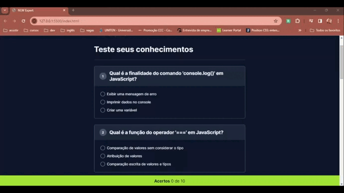

# Quiz sobre JavaScript
Este projeto foi desenvolvido durante a imersão NLW Expert da Rocketseat. Trata-se de um quiz com dez questões sobre fundamentos de JavaScript, criado para testar e aprimorar seus conhecimentos na linguagem. A aplicação registra e exibe a quantidade de respostas corretas, oferecendo uma experiência interativa para o usuário.

## Demonstração

## Tecnologias
- HTML
- CSS
- JavaScript
- Git e GitHub

## Aprendizados
Ao longo destas aulas, consegui mapear meu percurso de estudos, avaliando meu atual nível de conhecimento e identificando áreas nas quais preciso me aprofundar. Embora esteja no início da minha jornada com  JavaScript, percebi que há um vasto horizonte a ser explorado.

As técnicas apresentadas nas aulas me mostrou como é possível otimizar tanto o tempo quanto o código. Um exemplo notável foi a descoberta dos métodos `cloneNode()` e `appendChild()`. A utilização destes métodos em conjunto com a tag `<template>` do HTML revelou a possibilidade de deixar um elemento oculto e mostrá-lo utilizando apenas JavaScript, evitando a repetição da estrutura no documento HTML.

Essa experiência me mostrou que, à medida que vou aprimorando meu conhecimento, consigo ter novas visões e aplicá-las. Estou entusiasmada para aprender ainda mais e aplicar esses conhecimentos em projetos futuros.